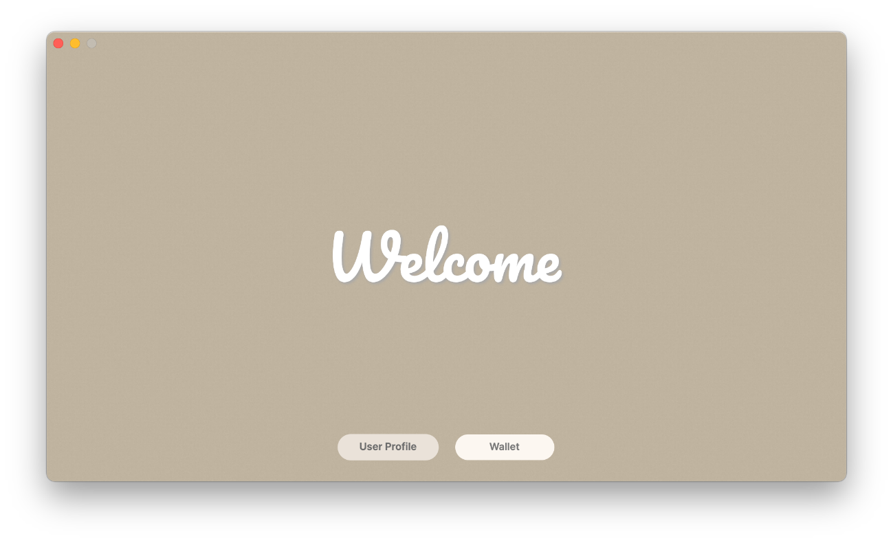
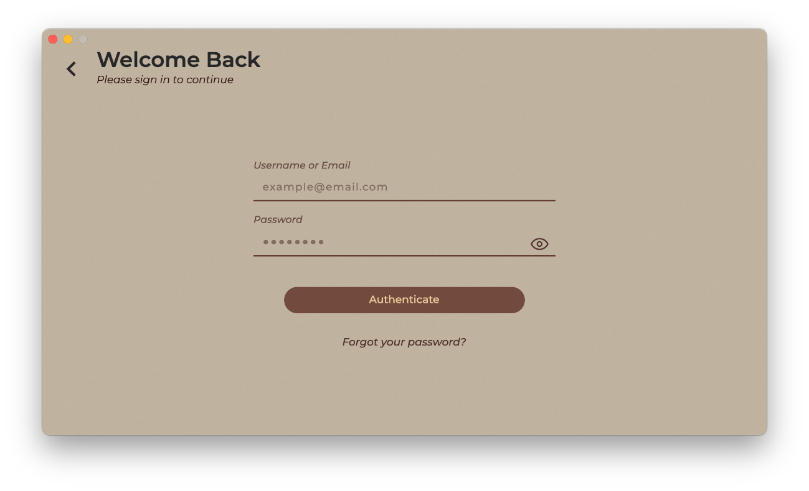
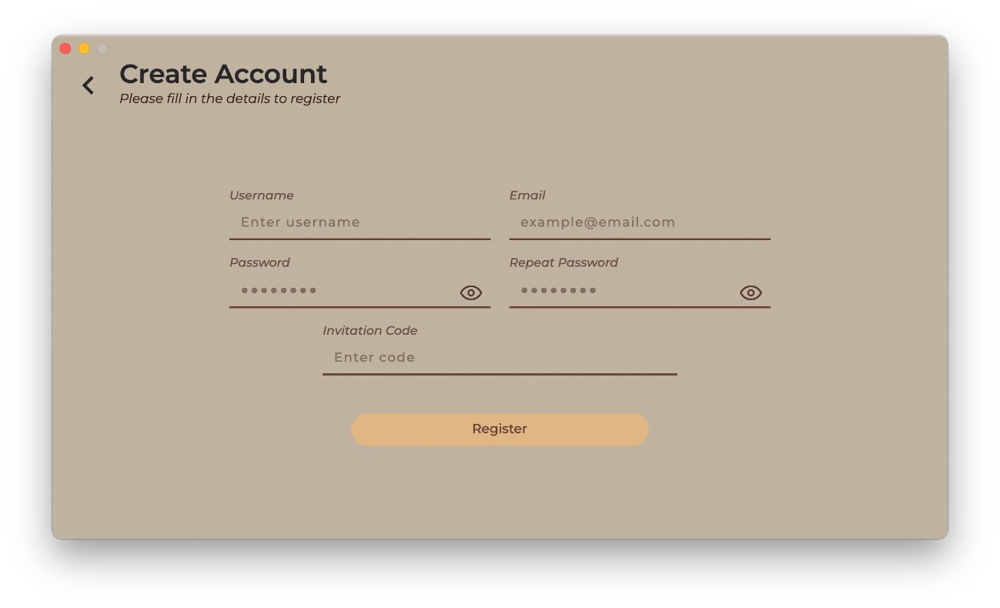
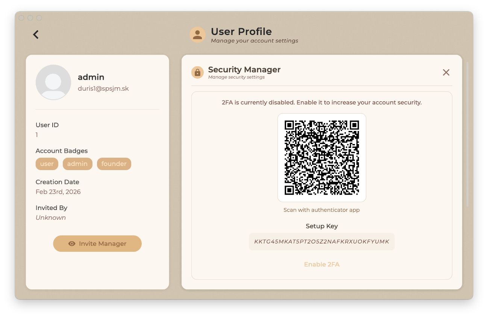
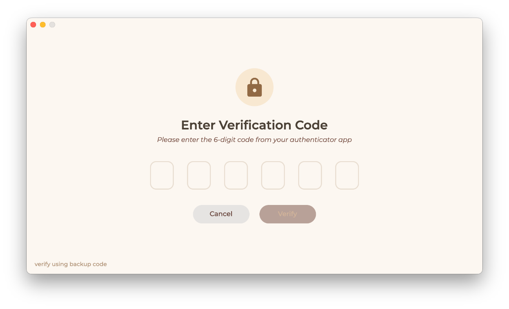
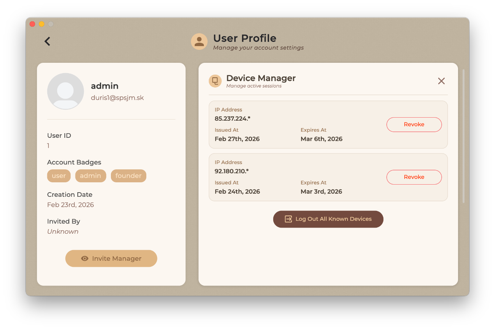
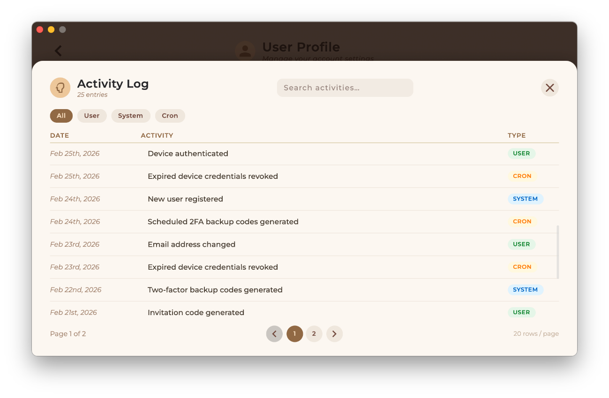
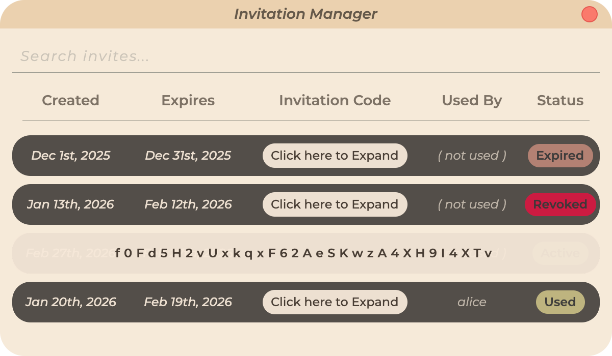
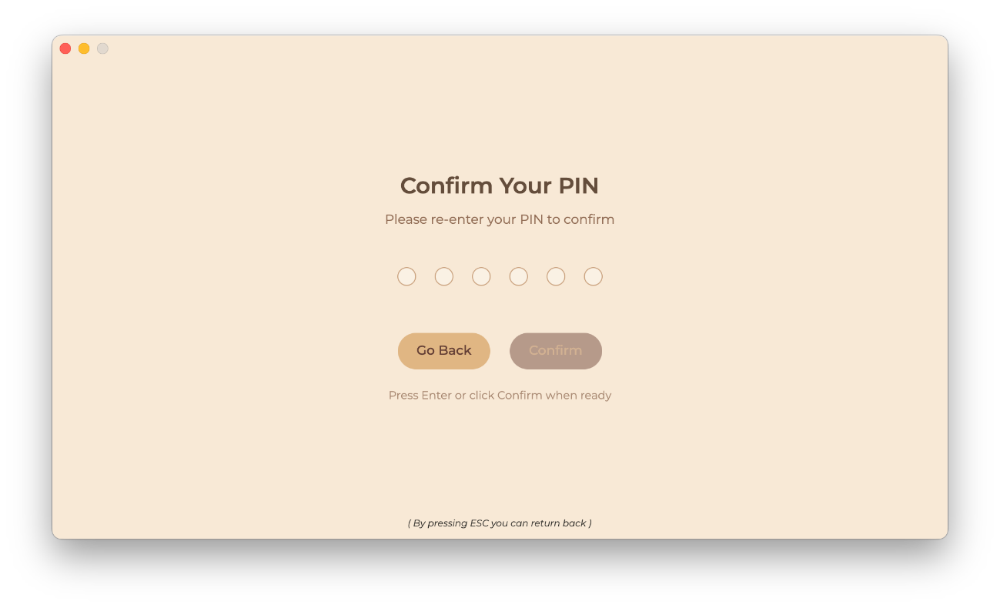

<div align="center">

<br/>

### Desktop Cryptocurrency Wallet

*Secure. Self-Custodial. Zero-Knowledge.*
#

<br/>


<br/>

[**Overview**](#overview) · [**Features**](#features) · [**Architecture**](#architecture) · [**Security**](#security-model) · [**Quick Start**](#quick-start) · [**Screenshots**](#screenshots) · [**Contributing**](#contributing)

<br/>

</div>

---

## Overview

**BlockSense** is a production-grade desktop cryptocurrency wallet built on a strict **zero-knowledge architecture** — private keys and seed phrases are generated locally, encrypted on-device, and never transmitted to any server under any circumstance.

The application is split into two independent components that communicate exclusively over HTTPS:

| Component | Technology | Responsibility |
|-----------|-----------|----------------|
| **Desktop Client** | Avalonia UI / C# | Key management, transaction signing, local encrypted storage |
| **Backend API** | ASP.NET Core / MySQL | Authentication, session management, blockchain relay |

> **The server never sees your keys.** All cryptographic operations — mnemonic generation, key derivation, transaction signing — happen exclusively in the client process's memory.

---

## Features

### Authentication & Authorization

- **Invite-only registration** via single-use, time-limited, revocable codes
- **Argon2id** password hashing with per-user random salts
- **JWT access tokens** (HMAC-SHA256, short-lived) + device-bound **refresh tokens** (SHA-256 hashed at rest)
- **TOTP two-factor authentication** (RFC 6238) compatible with Google Authenticator, Authy, and any TOTP app
- **Backup codes** — SHA-256 hashed, single-use, rate-limited regeneration
- **Brute-force protection** — constant-time password comparison (`FixedTimeEquals`) to eliminate timing attacks; 30-second lockout on repeated failures
- **Device fingerprinting** — refresh tokens bound to hardware + network identifiers; stolen tokens rejected on foreign devices
- **Role-based access control** — `standard`, `administrator`, `founder`, `banned`

### Wallet Management

- Create wallets from cryptographically secure entropy (**BIP39**, 128-bit, 12-word mnemonic)
- Import existing wallets via mnemonic phrase
- **Hierarchically deterministic** key derivation (**BIP32** / **BIP44**) — unlimited addresses, single backup
- Supported networks: **Bitcoin**, **Ethereum**, **Litecoin**
- **AES-256** encryption for seed and private key storage (key derived from 6-digit PIN)
- Integrity verification on every startup — corrupt or tampered wallet data detected before any operation
- Single-active-wallet enforcement to prevent accidental fund loss
- Export restricted to mnemonic phrase; phrase shown once, then purged from memory

### Transactions

- Local transaction signing — private key never leaves the client
- Server validates transaction format and cryptographic signature, then broadcasts to blockchain via external API
- Real-time balance synchronization via public wallet addresses
- Full transaction history with status tracking (`Pending` → `Confirmed`)

### Observability & Security

- **Global exception handler** — no internal stack traces or DB structure exposed to clients
- **Structured audit log** — append-only `activity_logs` table with microsecond timestamps; `user`, `system`, and `cron` event categories
- **Serilog** rolling file logs on the client with daily rotation
- **Database transactions** with rollback on partial failures (e.g., registration atomically marks the invite code as used)

---

## Architecture

```
┌─────────────────────────────────────────────────────────────────────┐
│                        DESKTOP CLIENT                               │
│                                                                     │
│  ┌───────────────┐    ┌──────────────┐    ┌──────────────────────┐  │
│  │  Avalonia UI  │───▶│   Services   │───▶│   LevelDB ( local )  │  │
│  │ ( XAML / C# ) │    │              │    │                      │  │
│  └───────────────┘    └──────┬───────┘    └──────────────────────┘  │
│                              │                                      │
│                              │  HTTPS                               │
└──────────────────────────────┼──────────────────────────────────────┘
                               │
┌──────────────────────────────┼──────────────────────────────────────┐
│                      ASP.NET CORE API                               │
│                              │                                      │
│  ┌───────────────┐    ┌──────▼───────┐    ┌──────────────────────┐  │
│  │  Controllers  │───▶│   Services   │───▶│     Repositories     │  │
│  │  ( REST API ) │    │ (auth · 2FA) │    │  ( Dapper / MySQL )  │  │
│  │               │    │              │    └──────────────────────┘  │
│  └───────────────┘    └──────┬───────┘                              │
│                              │                                      │
└──────────────────────────────┼──────────────────────────────────────┘
                               │
                  ┌──────────── ────────────┐
                  │                         │
           ┌──────▼──────┐            ┌─────▼──────┐
           │    MySQL    │            │  External  │
           │  Database   │            │ Blockchain │
           │             │            │    API     │
           └─────────────┘            └────────────┘
       
```

### Layer Responsibilities

| Layer | Location | Responsibility |
|-------|----------|----------------|
| **Presentation** | Client | Avalonia XAML views, view models |
| **Service** | Client + Server | Business logic, cryptographic operations |
| **Repository** | Server | Dapper-based data access, SQL queries |
| **Database** | Server | MySQL — users, sessions, 2FA, invites, audit |
| **Local Storage** | Client | LevelDB — encrypted wallet data |

---

## Security Model

BlockSense is designed around a **zero-knowledge** principle: the server is treated as an untrusted relay.

```
PRIVATE KEY LIFECYCLE
─────────────────────
Entropy (CSPRNG)
    └─▶ BIP39 Mnemonic (12 words)
            └─▶ BIP32 Master Seed
                    └─▶ BIP44 Derived Keys
                                │
                    ┌───────────▼─────────────────┐
                    │ AES-256 ( PIN-derived key ) │
                    └───────────┬─────────────────┘
                                │
                        LevelDB ( local disk )

  ✗  Seed phrase → Server        NEVER
  ✗  Private key → Server        NEVER
  ✗  PIN         → Server        NEVER
  ✓  Signed transaction → Server for broadcast only
  ✓  Public address → Server for balance sync only
```

### Cryptographic Primitives

| Purpose | Algorithm | Notes |
|---------|-----------|-------|
| Wallet entropy | CSPRNG | 128-bit minimum |
| Mnemonic derivation | BIP39 | 12-word wordlist |
| Key derivation | BIP32 / BIP44 | HD wallet standard |
| Seed/key encryption | AES-256-GCM | Nonce + auth tag stored inline |
| 2FA secret storage | AES-256-GCM | Key stored outside the database |
| Password hashing | Argon2id | Per-user random 128-bit salt |
| Refresh token storage | SHA-256 | Plaintext never persisted |
| Backup code storage | SHA-256 | One-time use, rate-limited regen |
| Access token signing | HMAC-SHA256 | Short-lived JWT with `jti` |
| API transport | TLS (HTTPS) | All client↔server traffic |

---

## Database Schema

Five tables cover the full server-side domain:

```
users                    ← master registry; soft-delete via deleted_at
 ├── activity_logs       ← append-only audit log (user / system / cron)
 ├── invitation_codes    ← single-use, time-limited, revocable
 ├── refresh_tokens      ← device-bound; SHA-256 hash only; UNIQUE on hardware fingerprint
 └── totp_credentials    ← AES-256-GCM encrypted secret; SHA-256 hashed backup codes
```

---

## Tech Stack

| Domain | Technology | Version |
|--------|-----------|---------|
| Desktop UI | Avalonia UI | 11.x |
| Language | C# | 12.0 |
| Runtime | .NET | 8.0 |
| Backend | ASP.NET Core Web API | 8.0 |
| Database | MySQL | 8.x |
| Local storage | LevelDB | — |
| Cryptography | BouncyCastle | 2.6.2 |
| JWT auth | Microsoft.AspNetCore.Authentication.JwtBearer | 8.0.23 |
| TOTP | Otp.NET | 1.4.1 |
| ORM | Dapper | 2.1.66 |
| DB client | MySql.Data | 9.6.0 |
| Logging | Serilog | 3.0.1 |
| Version control | Git | — |

---

## Quick Start

### Prerequisites

- [.NET 8.0 SDK](https://dotnet.microsoft.com/download/dotnet/8.0)
- [MySQL Server 8.x](https://dev.mysql.com/downloads/mysql/)
- Windows 10 / 11 (x64)
- Git

### 1 · Clone

```bash
git clone https://github.com/durismaros/BlockSense.git
cd BlockSense
```

### 2 · Database Setup

```sql
-- Connect to MySQL
mysql -u root -p

CREATE DATABASE blocksense;
USE blocksense;
```

```bash
# Apply the schema
mysql -u root -p blocksense < docs/database/schema.sql
```

### 3 · Configure Backend Secrets

BlockSense uses [.NET User Secrets](https://learn.microsoft.com/en-us/aspnet/core/security/app-secrets) — nothing sensitive goes in `appsettings.json`.

```bash
cd src/BlockSense.Backend

# MySQL connection string
dotnet user-secrets set "ConnectionStrings:DefaultConnection" \
  "Server=localhost;Database=blocksense;User=root;Password=<password>;"

# JWT signing key  (use a cryptographically random value, ≥ 256 bits)
dotnet user-secrets set "JwtTokenConfig:SigningKey" "<your-signing-key>"

# 2FA master encryption key  (used to encrypt TOTP secrets in the DB)
dotnet user-secrets set "TwoFactorAuthConfig:MasterKey" "<your-master-key>"
```

> **Generating secure keys:**
> ```bash
> # PowerShell
> [Convert]::ToBase64String((1..32 | ForEach-Object { Get-Random -Max 256 }))
> ```

### 4 · Run

```bash
# Terminal 1 — Backend API (https://localhost:5001)
dotnet run --project src/BlockSense.Backend/BlockSense.Backend.csproj

# Terminal 2 — Desktop client
dotnet run --project src/BlockSense.Desktop/BlockSense.Desktop.csproj
```

### 5 · First Launch

1. An admin must generate an **invitation code**
2. Register a new account using the invitation code
3. *(Optional but strongly recommended)* Enable **2FA** in User Profile → Security Manager
4. Navigate to **Wallet** and create or import a wallet

---

## Screenshots

<table>
  <tr>
    <td align="center"><b>Welcome Screen</b></td>
    <td align="center"><b>Login</b></td>
    <td align="center"><b>Registration</b></td>
  </tr>
  <tr>
    <td></td>
    <td></td>
    <td></td>
  </tr>
  <tr>
    <td align="center"><b>2FA Setup</b></td>
    <td align="center"><b>TOTP Verification</b></td>
    <td align="center"><b>Active Devices</b></td>
  </tr>
  <tr>
    <td></td>
    <td></td>
    <td></td>
  </tr>
  <tr>
    <td align="center"><b>Activity Log</b></td>
    <td align="center"><b>Invitation Manager</b></td>
    <td align="center"><b>PIN Confirmation</b></td>
  </tr>
  <tr>
    <td></td>
    <td></td>
    <td></td>
  </tr>
</table>

---

## Project Structure

```
BlockSense/
├── src/
│   ├── BlockSense.Backend/        # ASP.NET Core Web API
│   │   ├── Attributes/            # Custom attributes
│   │   ├── Controllers/           # REST API endpoints
│   │   ├── Data/                  # Database config & access
│   │   ├── Entities/              # Core entities
│   │   ├── Exceptions/            # Global error handling
│   │   ├── Extensions/            # Startup extensions
│   │   ├── Models/                # DTOs & request models
│   │   ├── Properties/            # Project settings
│   │   ├── Repositories/          # Dapper repositories
│   │   ├── Services/              # Business logic
│   │   └── Utilities/             # Shared helpers
│   │
│   ├── BlockSense.Contracts/      # Shared contracts library
│   │   ├── Cryptography/          # Shared crypto logic
│   │   ├── DTOs/                  # Shared DTOs
│   │   ├── Definitions/           # Interfaces & constants
│   │   └── Enums/                 # Shared enums
│   │
│   └── BlockSense.Desktop/        # Avalonia UI client
│       ├── Assets/                # Images, fonts, icons
│       ├── Models/                # UI models
│       ├── Properties/            # App settings
│       ├── Providers/             # Dependency providers
│       ├── Services/              # Crypto, wallet, API services
│       ├── Utilities/             # Desktop helpers
│       ├── Views/                 # XAML UI definitions
│       └── Windows/               # Application windows
│
├── docs/                          # Project documentation
│   ├── Duris.pdf                  # PDF documentation
│   └── Duris.docx                 # Word documentation
│
├── database/                      # Database resources
│   └── schema.sql                 # Full MySQL schema
│
└── screenshots/                   # UI screenshots
```
---

## Contributing

Contributions are welcome. Please follow the workflow below to keep the history clean and reviewable.

```bash
# 1. Fork and clone
git clone https://github.com/<your-username>/BlockSense.git

# 2. Create a feature branch
git checkout -b feature/your-feature-name

# 3. Commit with a descriptive message
git commit -m "feat: add hardware wallet support via HID"

# 4. Push and open a pull request
git push origin feature/your-feature-name
```

### Guidelines

- Follow existing code style and naming conventions
- Write tests for new features where applicable
- Document any new environment variables or configuration keys
- Ensure all existing tests pass before submitting
- Keep pull requests focused — one feature or fix per PR

### Commit Message Convention

```
<type>: <short description>

Types: feat | fix | docs | refactor | test | chore
```

---

## Roadmap

- [ ] Multi-wallet support (manage several wallets simultaneously)
- [ ] Incoming transaction push notifications
- [ ] Biometric authentication
- [ ] Hardware wallet integration (Ledger / Trezor via HID)
- [ ] Additional blockchain networks and token standards
- [ ] Linux builds

---

## License

Distributed under the **MIT License**. See [`LICENSE`](LICENSE) for full terms.

---

<div align="center">

<br/>

Built by **Maroš Ďuriš** with ❤️ · SPŠ Jozefa Murgaša, Banská Bystrica · 2025/2026

<br/>

[Report a Bug](https://github.com/durismaros/BlockSense/issues) · [Request a Feature](https://github.com/durismaros/BlockSense/issues)

<br/>

</div>
